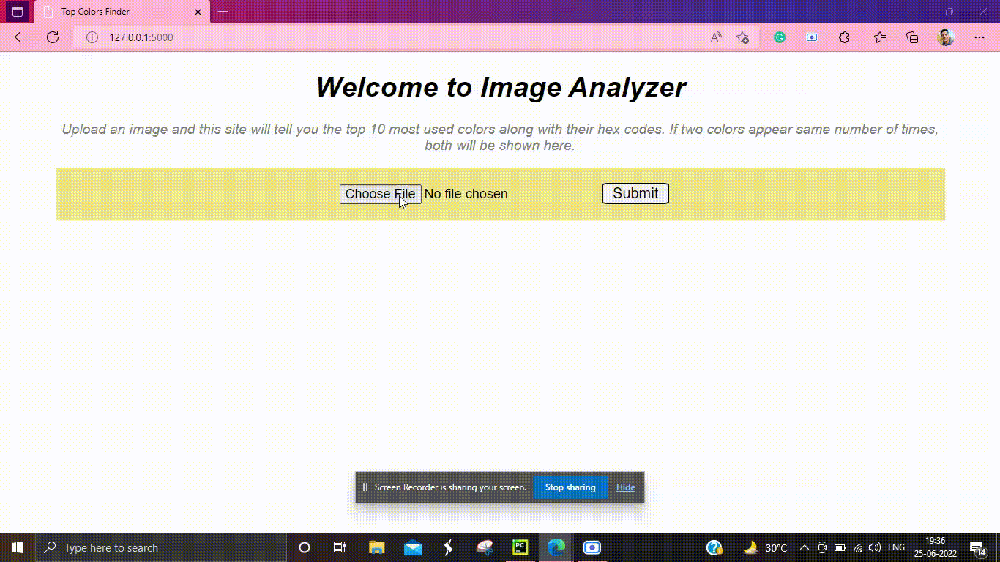

# Image Color Pallete Generator
A simple web application built using flask. Upload an image and see the most used colors in that image.

  

<h1> Program Flowchart </h1>

  

<h1> Guide to build this Project <em> (Work in Progress) </em> </h1>

<h2> Step1: Heading </h2>

  Text

<h2> Step2: Heading </h2>

  Text

<h2> Step3: Heading </h2>

  Text

<h2> Step4: Heading </h2>

  Text

